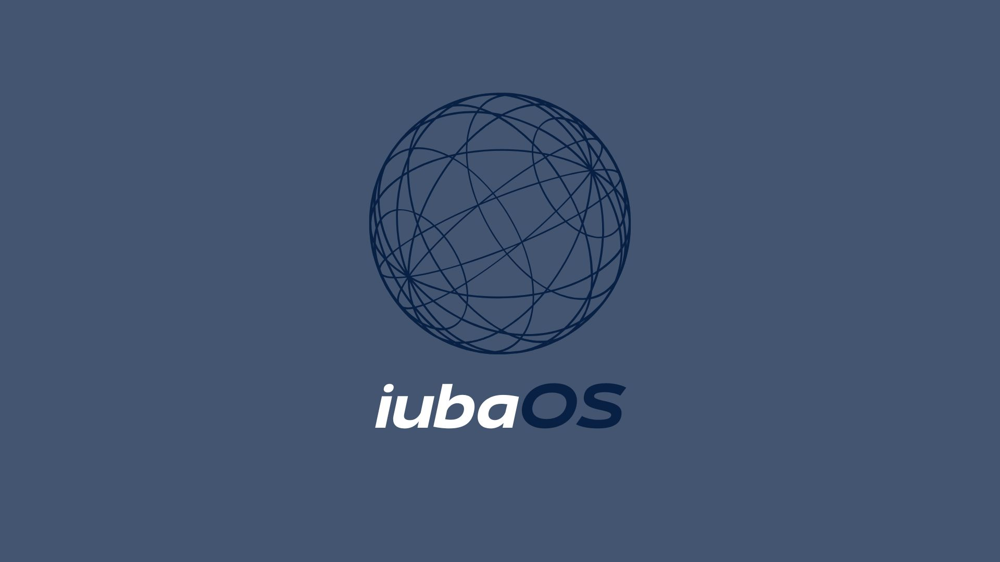

# iubaOS - Distribuição Linux Personalizada

## 🐧 Visão Geral

**iubaOS** é uma distribuição Linux personalizada, baseada no Xubuntu 22.04 LTS. Ela foi projetada para oferecer um ambiente computacional leve, estável e funcional, com um foco especial em produtividade, desenvolvimento e na experiência do usuário.

A filosofia do iubaOS é criar um sistema operacional que já venha pronto para o uso, combinando a robustez de uma base LTS com um conjunto de ferramentas e personalizações que otimizam o fluxo de trabalho diário.

---

## 🎯 Funcionalidades e Aplicações

Com base na documentação do projeto, os três aplicativos personalizados desenvolvidos em Python para a distribuição têm as seguintes funcionalidades:

* **NoteSyst**: Um aplicativo de gestão de notas e informações, ideal para organizar dados de forma estruturada.
* **ToDoList**: Um gerenciador de tarefas nativo para planejar e acompanhar atividades pendentes.
* **Ambiente de Desenvolvimento**: A distro já vem com **Visual Studio Code**, **Google Chrome** e **LibreOffice** pré-instalados para garantir um ambiente de trabalho completo.
* **Batalha Naval**: Inclui o clássico jogo Batalha Naval para momentos de descontração.

---

## 🛠️ Especificações Técnicas

| Componente          | Especificação                               |
| :------------------ | :------------------------------------------ |
| **Nome** | iubaOS                                      |
| **Base** | Xubuntu 22.04 LTS                           |
| **Arquitetura** | amd64 (x86_64)                              |
| **Ambiente Desktop**| XFCE, com personalizações profundas         |
| **Kernel** | Baseado no Kernel LTS do Ubuntu 22.04       |
| **Gerenciador de Pacotes** | APT (com suporte a `.deb`)             |
| **Sistema de Inicialização**| systemd                             |

### Requisitos Mínimos
* **Processador**: Intel Core i3 (2ª Geração) ou AMD Ryzen 3 (1ª Geração)
* **Memória RAM**: 4GB
* **Espaço em Disco**: 20GB

---

## ✨ Design e Personalização

A identidade visual do iubaOS foi cuidadosamente construída para ser moderna, coesa e agradável, utilizando os seguintes componentes:

* **Tema do Sistema**: Orchis (variante Grey-Dark)
* **Conjunto de Ícones**: Papirus (variante Dark)
* **Fonte Padrão**: Noto Sans
* **Papel de Parede**: Imagem de fundo personalizada com a identidade da iubaOS.

---

## 🔧 Destaques do Desenvolvimento

O iubaOS foi construído com o auxílio da ferramenta **Cubic (Custom Ubuntu ISO Creator)**. O processo envolveu a superação de desafios técnicos interessantes, como:

* **Resolução de dependências Python**: Integração de bibliotecas como `customtkinter` e `tkcalendar` via `pip`, contornando as restrições de ambientes gerenciados externamente (PEP 668) em um sistema de construção controlado.
* **Correção de scripts**: Resolução de conflitos de formato de quebra de linha (CRLF vs. LF) com a ferramenta `dos2unix` e padronização do *shebang* para garantir a portabilidade e execução correta dos scripts Python.
* **Aplicação de tema padrão**: Uso estratégico do diretório `/etc/skel` para criar arquivos de configuração padrão, garantindo que todos os novos usuários tenham a aparência customizada desde a primeira inicialização.

## 👥 Desenvolvedores

* **Gabriel Bauer**
* **Iuker de Souza Santos**
